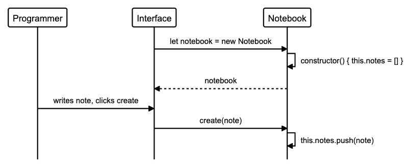
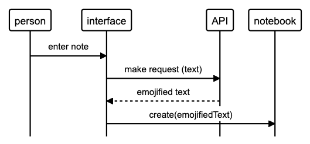

# Notes Web App

## User Stories
```
As a programmer
I can see a list of my notes, where each note is abbreviated to the first 20 characters
So I can find the one I want

As a programmer
I can create a new note
So I can record something I need to remember

As a programmer
I can see the full text of an individual note on its own page
So I can see all the information in the note

As a programmer
I can use shortcodes like `:fire:` that get converted into emojis like 🔥
So I can record notes with fun little pictures
```

### Extra User Story
```
As a programmer
I can refresh the page and still see my notes
So I can remember what I took down
```

## Sequence Diagrams




```flow
alias p = "Programmer"
alias i = "Interface"
alias nb = "Notebook"

i->nb: "let notebook = new Notebook"
nb->nb: "constructor() { this.notes = [] }"
nb-->i: "notebook"
p->i: "writes note, clicks create"
i->nb: "create(note)"
nb->nb: "this.notes.push(note)"
```




```flow
person->interface: "enter note"
interface->API: "make request (text)"
API-->interface: "emojified text"
interface->notebook: "create(emojifiedText)"
```
